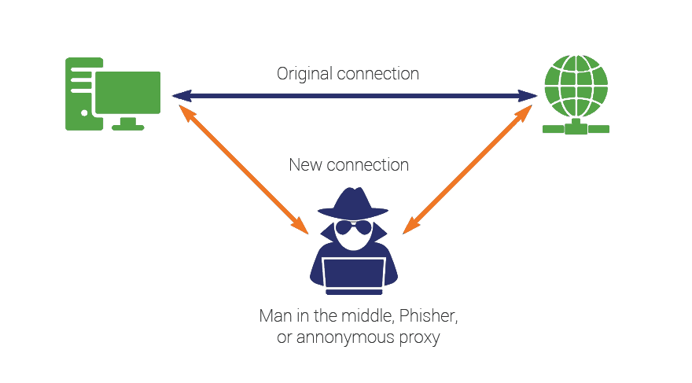

# Man In The Middle

## Cours

### Comprendre le protocole ARP et les tables ARP

Pour comprendre l’attaque MITM (Man in the middle), il faut comprendre simplement le protocole ARP.


Tout ce que vous devez savoir c’est que chaque machine du réseau possède un cache ARP. Comme son nom l’indique, c’est un cache, il est donc temporaire. 
Le cache ARP consiste en une correspondance entre les adresses IP et les adresses MAC des machines du réseau. Ces correspondances sont rangées dans des tables ARP.


Exemple de table ARP : 


Ci-dessus, deux commandes qui affichent les correspondances entre 2 ip du réseau et leur adresse MAC. On voit que l’adresse 10.5.0.1 a pour adresse MAC 02:42:8c:d5:51:03.

A ce stade, vous devriez avoir compris ce qu’est une table ARP. Cependant, vous avez lu juste avant qu’ARP était un protocole… En effet, pour remplir ces tables ARP, la machine va envoyer des requêtes aux autres machines sur le réseau. Les requêtes envoyées sont tout simplement comme le dialogue qui suit : 

votre_machine : “qui à l’adresse 10.5.0.2 ?”
machine_distante : “c’est moi, voici mon adresse MAC : 02:42:0a:05:00:02 !”

Et ainsi la machine ajoute une ligne à sa table ARP.

Lorsqu’une machine distante veut envoyer une requête à une destination, elle s’assure d’avoir un couple IP-MAC correct.

### Comprendre le fonctionnement d’une MITM (Man in The Middle) attaque

Le but de cette attaque est de tromper la machine victime en se faisant passer pour quelqu’un d’autre. Il faut ainsi envoyer des informations à une machine pour qu’il enregistre dans son cache ARP les mauvaises correspondances IP-MAC.

Si on veut observer toutes les communications entre une machine et un routeur, il faut se placer entre les deux machines (d’où l’appellation Man in the Middle). On dit à la victime “c’est moi le routeur”, ainsi elle enverra ses paquets à la machine attaquante, qui les transmettra ensuite au routeur. Lorsqu’une réponse arrive du routeur, l’attaquant dit au routeur “c’est moi qui suis la machine qui a envoyé cette requête”, l’attaquant a donc la requête qu’il renvoie à la machine victime.
Ce schéma résume bien l’attaque : 



[source](https://dwisesoft.com/wp-content/uploads/2020/08/man-in-the-middle-attack.png)

## Tutoriel

### MITM dans un environnement dédié

Il vous est possible de suivre et effectuer les mêmes étapes de ce tutoriel depuis votre machine en téléchargeant ce fichier : [docker-compose.yml](./docker-compose.yml)

### Lancement de l'environnement

Maintenant que vous avez téléchargé le fichier docker-compose.yml, vous pouvez récupérer et lancer les machines utiles pour ce tutoriel en tapant la commande : 

```shell
$ docker-compose up -d
```

Lorsque l'opération est finie, vous pouvez lister vos conteneurs avec la commande :

```shell
$ docker ps -a
```
Vous devriez voir une réponse similaire à celle ci-dessous : 


Maintenant, ouvrons 2 Terminal séparés et connectons nous aux deux machines : 
Pour utiliser la machine attaquante, tapez la commande : 
```shell
$ docker exec -it attaquant /bin/bash
```

Pour utiliser la machine victime, tapez la commande : 
```shell
$ docker exec -it victime /bin/bash
```

Vous êtes maintenant connecté aux deux machines et vous devriez avoir deux Terminal ouverts comme cela : 


### Vérification de la Configuration

Regardons les adresses ip de nos deux machines à l'aide de la commande : 
```shell
$ ifconfig
```

Vous obtenez normalement une réponse comme suit : 


On voit bien que la machine attaquante a pour adresse IP **10.5.0.2** et la machine victime **10.5.0.3**.


Vérifions maintenant la connectivité entre les différentes machines. Sur la machine attaquante, utilisons la commande **ping** afin de voir si la machine victime nous répond : 
```shell
$ ping 10.5.0.3
```
(Tapez Ctrl+C pour arrêter l'exécution de la commande)

Vous devriez voir cela : 


Les paquets circulent bien, donc tout est bien configuré.


### L'attaque